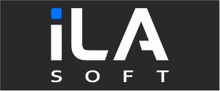

  

  **Practical, high-performance audio software for creators and live performers.**

  [Company](https://ila-soft.com) · [idolLiveAudio](https://idolliveaudio.com) · [Support](https://ila-soft.com/support) · [Contact](mailto:admin@idolliveaudio.com)

## About us

**ILA SOFT COMPANY LIMITED** is an independent software vendor (ISV) based in Vietnam. We research, design, and publish proprietary desktop audio software, low-latency driver technology, and cloud infrastructure for creators.

Our products are shaped by real production needs and continuous use in live environments. We focus on reducing setup complexity so performers can spend less time managing software and more time creating.

## Products and technology

| Product | Status | Description |
| --- | --- | --- |
| **[idolLiveAudio](https://idolliveaudio.com)** | Available · Active development | A Windows live vocal workstation combining real-time audio processing, VST3 hosting, music playback, soundboard, recording, preset workflows, and broadcast-ready routing in one focused application. |
| **[iLA VAD](https://idolliveaudio.com/Technology/IlaVad)** | Private beta | A low-latency virtual audio driver and ASIO bridge designed as the integrated audio foundation of the idolLiveAudio ecosystem. Beta access is currently available by request. |
| **iLA Cloud Platform** | Production infrastructure | The account, licensing, update delivery, catalog, preset, payment, and support infrastructure behind iLA Soft products. |

## Partner and developer roadmap

> **Planned — not yet generally available**

iLA Soft plans to expand iLA VAD into a developer and B2B integration platform, including:

- SDK and API access for approved software, hardware, and platform partners
- OEM and commercial integration options for Windows audio products
- Partner documentation, licensing, and technical support workflows
- Future B2B distribution opportunities, including evaluation of the Microsoft commercial marketplace

Organizations interested in future integration or early technical discussions may contact [admin@idolliveaudio.com](mailto:admin@idolliveaudio.com).

## What we build

- Real-time Windows audio applications
- VST3 hosting and practical live-performance workflows
- Low-latency virtual audio drivers and ASIO integration
- Preset, catalog, licensing, and update-delivery platforms
- Creator tools validated through real-world livestream use

## How we work

- **Practical first** — technology should solve a real workflow problem.
- **Built for live use** — reliability and predictable behavior matter when the broadcast is running.
- **Integrated by design** — applications, drivers, and cloud services should work as one product ecosystem.
- **Continuously validated** — feedback from daily use directly shapes each release.

## What is next

We are continuing to develop the integrated iLA audio ecosystem for Windows creators. New products and technologies are announced when they reach a validated public or beta-testing stage; early concepts and internal experiments remain private until they are ready.

> Most iLA Soft source repositories are private because our products are proprietary. Public documentation, SDKs, and selected developer resources will appear here when they are ready for external use.

<strong>Tiếng Việt</strong>

## Về iLA Soft

**CÔNG TY TNHH ILA SOFT** là công ty sản phẩm phần mềm độc lập (ISV) tại Việt Nam, nghiên cứu, phát triển và phát hành phần mềm âm thanh desktop, công nghệ driver độ trễ thấp và hạ tầng cloud dành cho nhà sáng tạo nội dung.

Sản phẩm của chúng tôi được hình thành từ nhu cầu vận hành thực tế và được kiểm chứng liên tục trong môi trường livestream. iLA Soft tập trung đơn giản hóa những quy trình audio phức tạp để người biểu diễn dành nhiều thời gian hơn cho việc sáng tạo.

- **idolLiveAudio** — workstation xử lý vocal và âm thanh trực tiếp trên Windows, hiện đang được phát triển và phát hành.
- **iLA VAD** — driver âm thanh ảo và ASIO bridge độ trễ thấp, hiện trong giai đoạn Beta Test theo yêu cầu.
- **iLA Cloud Platform** — hạ tầng tài khoản, bản quyền, cập nhật, catalog, preset, thanh toán và hỗ trợ cho hệ sinh thái iLA Soft.

Trong định hướng tiếp theo, iLA Soft dự kiến phát triển SDK/API của iLA VAD dành cho đối tác phần mềm, phần cứng và các nhu cầu tích hợp B2B/OEM. Công ty cũng sẽ đánh giá khả năng phân phối thương mại trong tương lai thông qua Microsoft commercial marketplace. Đây là định hướng đang được chuẩn bị, chưa phải thông báo phát hành hoặc xác nhận phê duyệt từ Microsoft.

Chúng tôi chỉ công bố sản phẩm hoặc công nghệ mới khi đã đạt đến giai đoạn thử nghiệm được kiểm chứng. Các ý tưởng và thử nghiệm nội bộ sẽ được giữ kín cho đến khi sẵn sàng.

---

  © 2026 ILA SOFT COMPANY LIMITED · Vietnam

